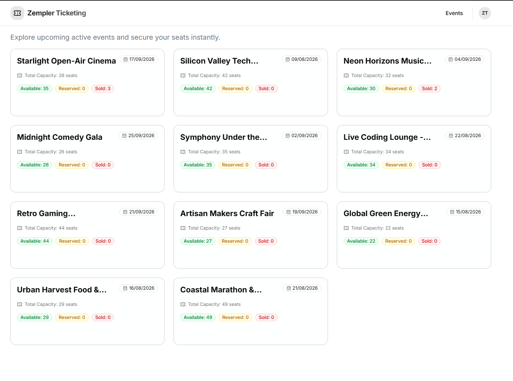
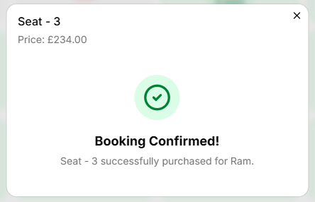

# Zempler.Ticketing

A small ticketing system with a .NET backend and a Next.js frontend.

## What it is

The backend is a vertical-slice API that handles events and tickets. Each feature is grouped around a workflow, so endpoints, models, and validation stay close together.

The frontend is a simple Next.js app that shows events, event details, and lets users reserve or purchase tickets.

## Project layout

- `src/Zempler.Ticketing/` – backend API
- `src/Zempler.Ticketing.Web/` – frontend app
- `tests/Zempler.Ticketing.Tests/` – unit & integration tests

## Tech stack

- Backend: .NET 10, C#, Carter, EF Core, SQLite, Serilog
- Frontend: Next.js 16, React 19, TypeScript, Tailwind CSS

## Database

- SQLite for local development
- `AppDbContext` with `Events` and `Tickets`
- Seed data created automatically in development mode

## Why vertical slice

The app is organized by feature rather than by technical layers. That means the event and ticket flows are easier to understand and change, especially when adding new behavior.

## Run it locally

### Backend

Open `src/Zempler.Ticketing` and run the project.

### Frontend

From `src/Zempler.Ticketing.Web/`:

```bash
npm install
npm run dev
```

### Notes

- The frontend uses `NEXT_PUBLIC_API_URL` for the API base URL.
- If that is not set, it defaults to `http://localhost:5000/api`.

## Future improvements

- Add authentication and user accounts
- Improve concurrency handling and cache invalidation
- Add Redis for read-heavy caching and faster event queries
- Prepare the backend for horizontal scaling by keeping it stateless and sharing cache/data externally
- Implement internationalization for static text directly in html tags

## Screenshots

Below are a few screenshots from the app. Full-size images are in the `screenshots/` folder.

- Landing page



- Event with reserved ticket


- Reserve ticket flow


- Make payment (mock)


- Confirmation



- Scalar UI for API


